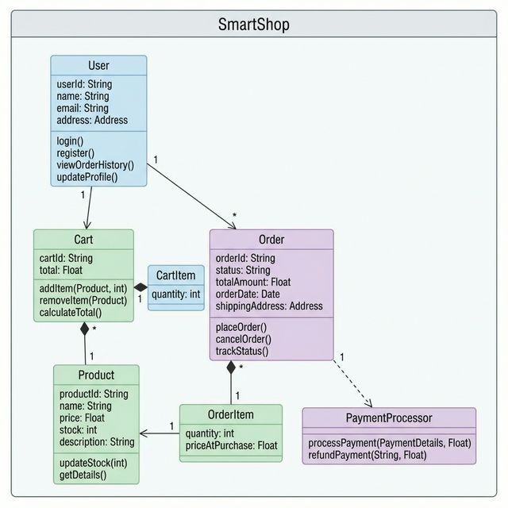
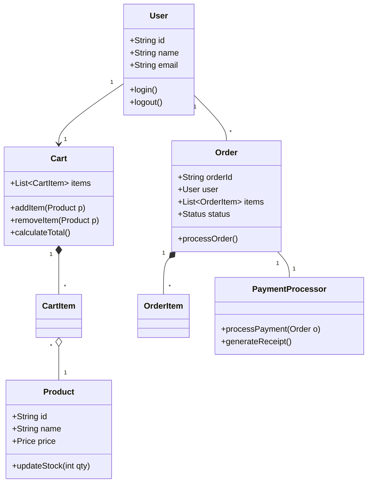

# Class Diagram

View Mermaid Code

```mermaid
classDiagram
    class User {
        +String id
        +String name
        +String email
        +login()
        +logout()
    }

    class Product {
        +String id
        +String name
        +Price price
        +updateStock(int qty)
    }

    class Cart {
        +List~CartItem~ items
        +addItem(Product p)
        +removeItem(Product p)
        +calculateTotal()
    }

    class Order {
        +String orderId
        +User user
        +List~OrderItem~ items
        +Status status
        +processOrder()
    }

    class PaymentProcessor {
        +processPayment(Order o)
        +generateReceipt()
    }

    User "1" --> "1" Cart
    Cart "1" *-- "*" CartItem
    CartItem "*" o-- "1" Product
    User "1" -- "*" Order
    Order "1" *-- "*" OrderItem
    Order "1" -- "1" PaymentProcessor
```

