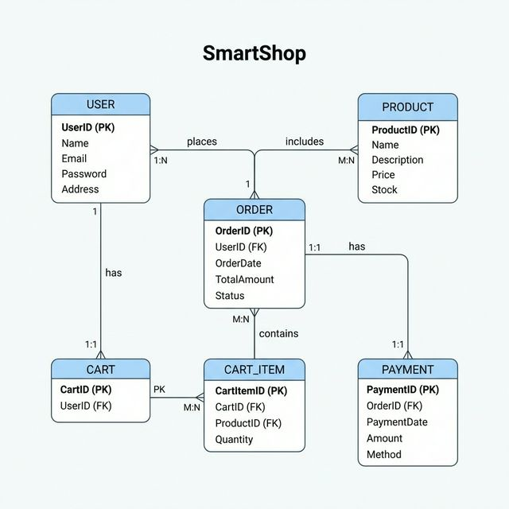
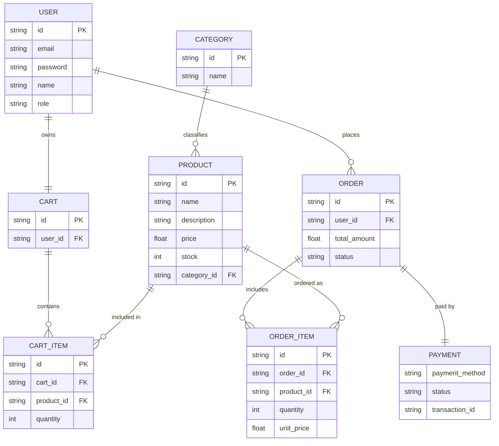

# ER Diagram (Entity-Relationship)

View Mermaid Code

```mermaid
erDiagram
    USER ||--|| CART : owns
    USER ||--o{ ORDER : places
    CATEGORY ||--o{ PRODUCT : classifies
    CART ||--o{ CART_ITEM : contains
    ORDER ||--o{ ORDER_ITEM : includes
    
    PRODUCT ||--o{ CART_ITEM : "included in"
    PRODUCT ||--o{ ORDER_ITEM : "ordered as"
    ORDER ||--|| PAYMENT : "paid by"

    USER {
        string id PK
        string email
        string password
        string name
        string role
    }

    PRODUCT {
        string id PK
        string name
        string description
        float price
        int stock
        string category_id FK
    }

    CATEGORY {
        string id PK
        string name
    }

    ORDER {
        string id PK
        string user_id FK
        float total_amount
        string status
    }

    ORDER_ITEM {
        string id PK
        string order_id FK
        string product_id FK
        int quantity
        float unit_price
    }

    CART {
        string id PK
        string user_id FK
    }

    CART_ITEM {
        string id PK
        string cart_id FK
        string product_id FK
        int quantity
    }

    PAYMENT {
        string payment_method
        string status
        string transaction_id
    }
```

