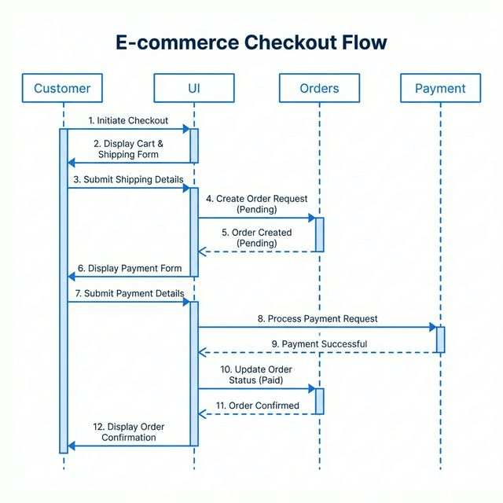
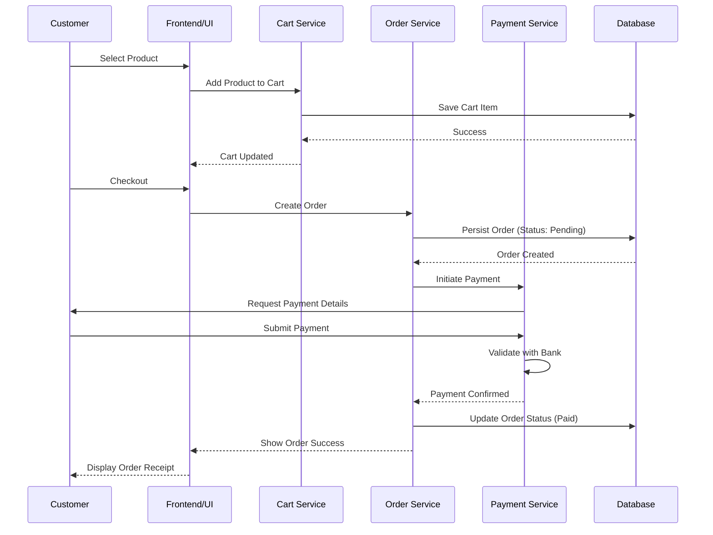

# Sequence Diagram: Customer Purchase Flow

View Mermaid Code

```mermaid
sequenceDiagram
    participant C as Customer
    participant UI as Frontend/UI
    participant CS as Cart Service
    participant OS as Order Service
    participant PS as Payment Service
    participant DB as Database

    C->>UI: Select Product
    UI->>CS: Add Product to Cart
    CS->>DB: Save Cart Item
    DB-->>CS: Success
    CS-->>UI: Cart Updated

    C->>UI: Checkout
    UI->>OS: Create Order
    OS->>DB: Persist Order (Status: Pending)
    DB-->>OS: Order Created
    
    OS->>PS: Initiate Payment
    PS->>C: Request Payment Details
    C->>PS: Submit Payment
    PS->>PS: Validate with Bank
    PS-->>OS: Payment Confirmed
    
    OS->>DB: Update Order Status (Paid)
    OS-->>UI: Show Order Success
    UI-->>C: Display Order Receipt
```

