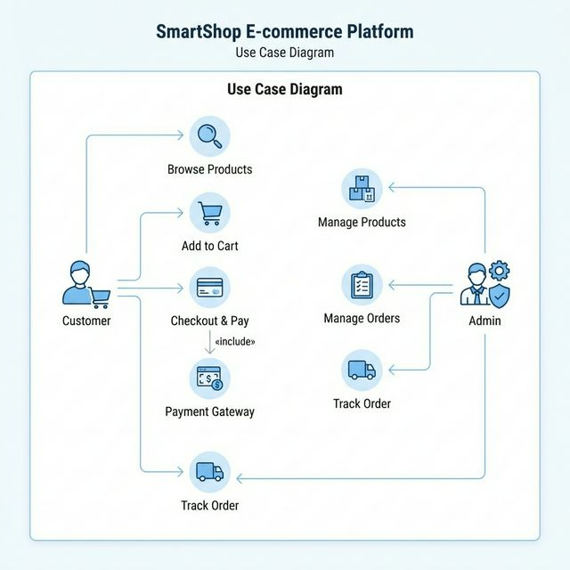

# Use Case Diagram



<details>
<summary>View Mermaid Code</summary>

```mermaid
useCaseDiagram
    actor Customer
    actor Admin
    actor "Payment Gateway" as PG

    package "SmartShop System" {
        usecase "Browse Products" as UC1
        usecase "Add to Cart" as UC2
        usecase "Checkout & Pay" as UC3
        usecase "Track Order" as UC4
        usecase "Manage Products" as UC5
        usecase "Manage Orders" as UC6
        usecase "Process Payment" as UC7
    }

    Customer --> UC1
    Customer --> UC2
    Customer --> UC3
    Customer --> UC4

    Admin --> UC5
    Admin --> UC6
    Admin --> UC4

    UC3 ..> UC7 : <<include>>
    UC7 -- PG
```
</details>
